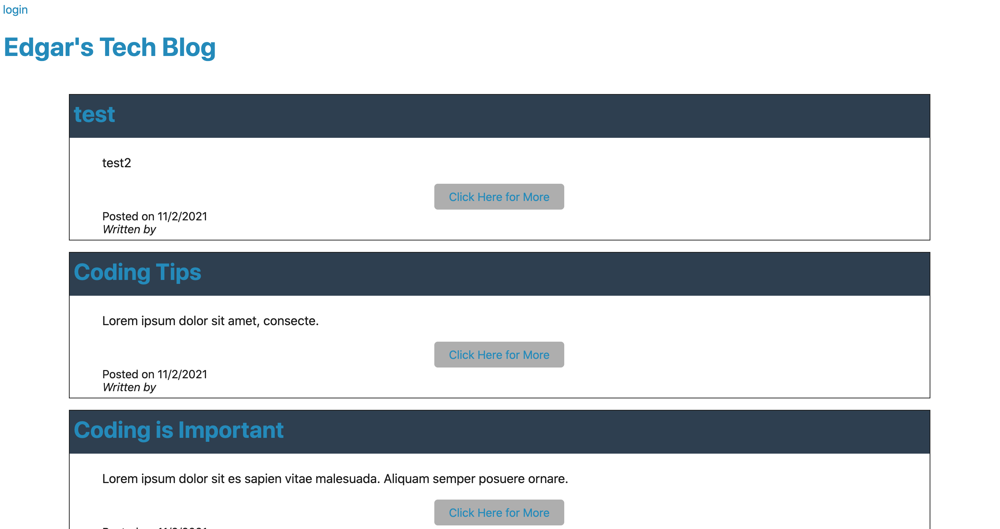
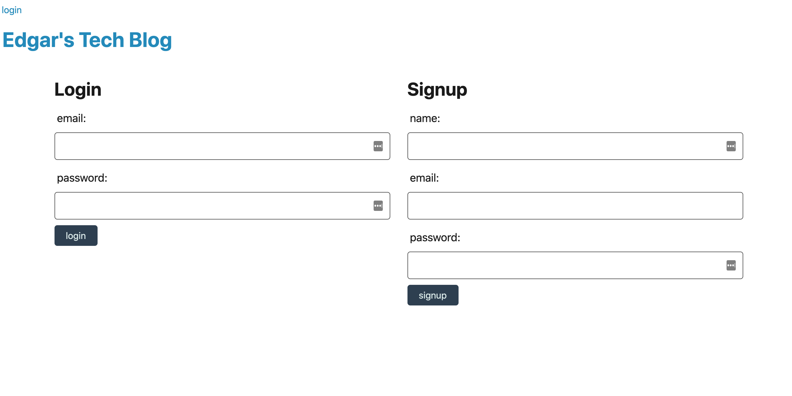
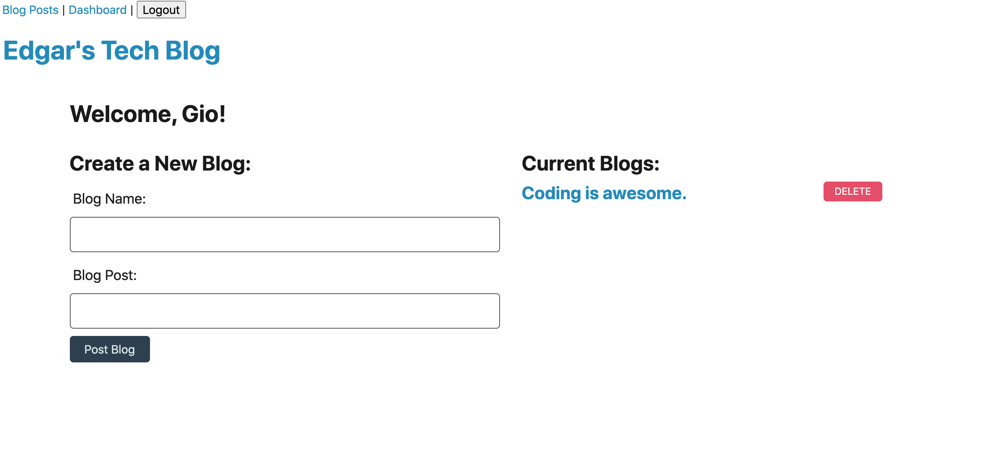

# Tech-Blog
[](https://opensource.org/licenses/MIT)

Link to deployed site on Heroku: https://edgar-tech-blog.herokuapp.com/
## Description
The Tech Blog was build with Node.js, MySQL, Handlebars.js, and the use of the Model View Controller. This app was able to be deployed with Heroku. This app supports account creating with secure password hashing with Bcrypt and storage as well as the ability to log in. User will be able to see all posts before loggin in as well as being able to delete the posts they have made in their dashboard. They can also create posts at the dashboard. In future versions, I would like to add comments and the ability to update posts. 

## Table of Contents

- [Installation](#installation)
- [Usage](#usage)
- [Contributing](#contributing)
- [Tests](#tests)
- [Screenshots](#screenshots)
- [License](#license)
- [Questions](#questions)
- [Acknowledgments](#acknowledgments)

### Installation
After downloading this repository, go into the folder of this project. Then run npm install or i. 

### Usage
First run mySQL -u root -p and enter password. Source the schema.sql. Then edit the env.Example file with your MYSQL username and password. Then save your file as .env . Then you can use run npm seed to load the database, then run npm watch to run nodemon or run npm start to just run the server.js if there are no updates expected to be made. You can open Insomnia Core to enter any route create in the /routes/api directory. Using GET,POST,PUT and DELETE functions of Insomnia you can view and update the database.

You can also visit the Heroku link above to see the deployed site.

### Contributing
Feel free to fork or clone this repo and make your own versions.

### Tests
API Get, POST, PUT, and DELETE routes in Insomnia Core can be opened and tested to create,update and delete data in the database.


###  Screenshots 
Homepage

Signup or login page

Dashboard



###  License

Copyright &copy; 2021 Edgar Ortega

This project is licensed under the terms of the <a href="https://opensource.org/licenses/MIT" target= "_blank" > MIT </a> license.

### Questions

Send questions to edort93@gmail.com or visit <a href="https://github.com/edgarO93" target= "_blank" >my profile </a><br>

### Acknowledgments

```
I would like to thank online resources such as W3 schools, MDN Web Docs, and Stack Overflow.
```